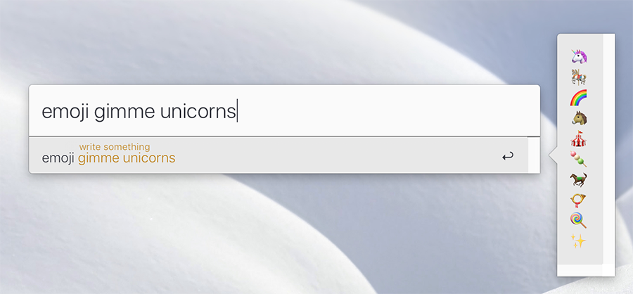

# lacona-emojis-from-text
> [Lacona](https://www.lacona.io/) addon to find relevant emojis from text

Uses the API from [Dango](http://getdango.com/api-docs/)

## Usage

In Lacona, type `emoji` and some text to find relevant emojis, and <kbd>Enter</kbd>, to copy on clipboard.